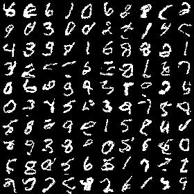
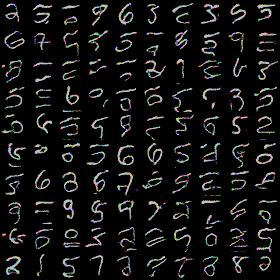
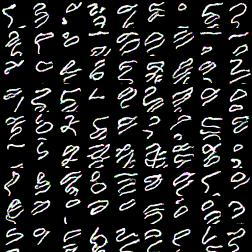

# Description

WaveNet replication study. Before stepping up to WaveNet implementation it was decided to implement PixelCNN first as WaveNet based on its architecture.

### What's need to be implemented

 1. [ ] Channel masks, can't get 256-way softmax MNIST generate meaningul images
 1. [ ] Gated layers
 1. [ ] Conditioning on labels
 1. [ ] CIFAR training
 1. [ ] Skip connections
 1. [ ] Vertical and horizontal stacks

Top priority are for Gated layers and label conditioning as these features used in WaveNet and they will be definitely useful. Others are nice bonuses to have.

Additionally, it would be nice to implement some stuff from PixelCNN++ paper.

### Some images:

 1. 10 epoch, sigmoid loss, black/white image.
    
 1. 10 epoch, 8-way (category) softmax loss, grayscale.
    
 1. 25 epoch, 8-way softmax loss, RGB image, no channel conditioning (only context).
    
 1. 25 epoch, 256-way softmax loss, RGB image, no channel conditioning (only context).
    

# Links

 1. [Website](https://deepmind.com/blog/wavenet-generative-model-raw-audio/)
 1. [WaveNet](https://arxiv.org/pdf/1609.03499.pdf)
 1. [PixelRNN](https://arxiv.org/pdf/1601.06759v3.pdf)
 1. [Conditional PixelCNN](https://arxiv.org/pdf/1606.05328v2.pdf)
 1. [PixelCNN++ repo](https://github.com/openai/pixel-cnn)
 1. [PixelCNN++ paper](https://openreview.net/pdf?id=BJrFC6ceg)

# Other implementations

 1. [tensorflow](https://github.com/ibab/tensorflow-wavenet)
 1. [chainer](https://github.com/monthly-hack/chainer-wavenet)
 1. [keras #1](https://github.com/usernaamee/keras-wavenet)
 1. [keras #2](https://github.com/basveeling/wavenet/)

# Other resources

 1. [Fast wavenet](https://github.com/tomlepaine/fast-wavenet)

