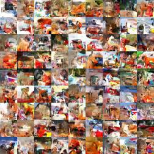
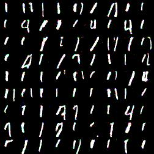
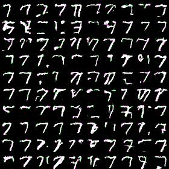
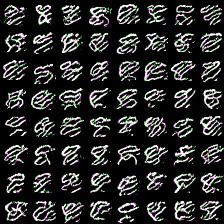
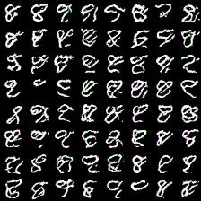

# Description

WaveNet replication study. Before stepping up to WaveNet implementation it was decided to implement PixelCNN first as WaveNet based on its architecture.

This repository contains two modes: [Gated PixelCNN][pixelcnn-paper] and [WaveNet][wavenet-paper], see class definitions in `wavenet/models.py`.

## Gated PixelCNN

```
$ python3 train.py --help
usage: train.py [-h] [--batchsize BATCHSIZE] [--epoch EPOCH] [--gpu GPU]
                [--resume RESUME] [--out OUT] [--hidden_dim HIDDEN_DIM]
                [--out_hidden_dim OUT_HIDDEN_DIM] [--blocks_num BLOCKS_NUM]
                [--gradclip GRADCLIP] [--learning_rate LEARNING_RATE]
                [--levels LEVELS] [--dataset DATASET] [--stats STATS]

PixelCNN

optional arguments:
  -h, --help            show this help message and exit
  --batchsize BATCHSIZE, -b BATCHSIZE
                        Number of images in each mini-batch
  --epoch EPOCH, -e EPOCH
                        Number of sweeps over the dataset to train
  --gpu GPU, -g GPU     GPU ID (negative value indicates CPU)
  --resume RESUME, -r RESUME
                        Resume the training from snapshot
  --out OUT, -o OUT     Output directory
  --hidden_dim HIDDEN_DIM, -d HIDDEN_DIM
                        Number of hidden dimensions
  --out_hidden_dim OUT_HIDDEN_DIM
                        Number of hidden dimensions
  --blocks_num BLOCKS_NUM, -n BLOCKS_NUM
                        Number of layers
  --gradclip GRADCLIP   Bound for gradient hard clipping
  --learning_rate LEARNING_RATE
                        Bound for gradient hard clipping
  --levels LEVELS       Level number to quantisize pixel values
  --dataset DATASET     Dataset for training. Either mnist or cifar.
  --stats STATS         Collect layerwise statistics
```

Command to train model on GPU with MNIST dataset (will be downloaded automatically):

    python train.py -g0 --levels 256 --out data/

To train with CIFAR-10 dataset use `--dataset` switch:

    python train.py -g0 --levels 256 --out data/ --dataset cifar

To save training time simplifying architecture is useful:
 * Reduce number of blocks (`--blocks_num 4`)
 * Reduce hidden dimensionality (`--hidden_dim 32`)
 * Reduce output softmax cardinality (`--levels 16`)

Once you have model trained you can generate samples.
```
python3 infer.py --help
usage: infer.py [-h] [--gpu GPU] [--model MODEL] [--hidden_dim HIDDEN_DIM]
                [--out_hidden_dim OUT_HIDDEN_DIM] [--blocks_num BLOCKS_NUM]
                [--levels LEVELS] [--output OUTPUT] [--label LABEL]
                [--count COUNT] [--height HEIGHT] [--width WIDTH]

PixelCNN

optional arguments:
  -h, --help            show this help message and exit
  --gpu GPU, -g GPU     GPU ID (negative value indicates CPU)
  --model MODEL, -m MODEL
                        Path to model for generation
  --hidden_dim HIDDEN_DIM, -d HIDDEN_DIM
                        Number of hidden dimensions
  --out_hidden_dim OUT_HIDDEN_DIM
                        Number of hidden dimensions
  --blocks_num BLOCKS_NUM, -n BLOCKS_NUM
                        Number of layers
  --levels LEVELS       Level number to quantisize pixel values
  --output OUTPUT, -o OUTPUT
                        Output filename
  --label LABEL, -l LABEL
                        Class label to generate
  --count COUNT, -c COUNT
                        Number of images to generate (woulld be squared: so
                        for 10 it would generate 100)
  --height HEIGHT       Output image height
  --width WIDTH         Output image width
```

Command for samples generation (you should specify exactly the same architecture for generation as you used for training otherwise you'd get weird results):

    python infer.py -g0 --levels 256 -m data/pixecnn_XXXXX --output samples.jpg

## WaveNet

WaveNet model is still in 'work in progress' state, some minor changes could happen. Also, it wasn't trained end-to-end on any dataset yet (only very small ones).

WaveNet expects input data to be preprocessed with `preprocess.py`.

```
usage: preprocess.py [-h] [--data DATA] [--output OUTPUT] [--workers WORKERS]
                     [--rate RATE] [--stacks_num STACKS_NUM]
                     [--layers_num LAYERS_NUM] [--target_length TARGET_LENGTH]
                     [--flush_every FLUSH_EVERY]

optional arguments:
  -h, --help            show this help message and exit
  --data DATA
  --output OUTPUT
  --workers WORKERS
  --rate RATE
  --stacks_num STACKS_NUM
  --layers_num LAYERS_NUM
  --target_length TARGET_LENGTH
  --flush_every FLUSH_EVERY
```

You specify path to your wav files and it recursively searches the path, subsamples it and split into chunks. Note that you need to specify number of stacks and number of layers per stack in order to calculate receptive field size.

Example of data preprocessing step:

    python preprocess.py --data vctk/wav/p225 --rate 16000 --stacks_num 4 --layers_num 10

It will generate several files named `vctk_*` (names are hard-coded) that are expected by WaveNet model data loader.

```
$ python3 train_wavenet.py --help
usage: train_wavenet.py [-h] [--batchsize BATCHSIZE] [--epoch EPOCH]
                        [--gpu GPU] [--resume RESUME] [--out OUT]
                        [--data DATA] [--hidden_dim HIDDEN_DIM]
                        [--out_hidden_dim OUT_HIDDEN_DIM]
                        [--stacks_num STACKS_NUM] [--layers_num LAYERS_NUM]
                        [--learning_rate LEARNING_RATE] [--clip CLIP]
                        [--weight_decay WEIGHT_DECAY] [--levels LEVELS]
                        [--stats]

PixelCNN

optional arguments:
  -h, --help            show this help message and exit
  --batchsize BATCHSIZE, -b BATCHSIZE
                        Number of images in each mini-batch
  --epoch EPOCH, -e EPOCH
                        Number of sweeps over the dataset to train
  --gpu GPU, -g GPU     GPU ID (negative value indicates CPU)
  --resume RESUME, -r RESUME
                        Resume the training from snapshot
  --out OUT, -o OUT     Output directory
  --data DATA, -d DATA  Input data directory
  --hidden_dim HIDDEN_DIM
                        Number of hidden dimensions
  --out_hidden_dim OUT_HIDDEN_DIM
                        Number of hidden dimensions
  --stacks_num STACKS_NUM, -s STACKS_NUM
                        Number of stacks
  --layers_num LAYERS_NUM, -l LAYERS_NUM
                        Number of layers per stack
  --learning_rate LEARNING_RATE
                        Learning rate
  --clip CLIP           L2 norm gradient clipping
  --weight_decay WEIGHT_DECAY
                        Weight decay rate (L2 regularization)
  --levels LEVELS       Level number to quantisize values
  --stats               Collect layerwise statistics
```

Command for model training:

    python train_wavenet.py -g0 --out data/ --stacks_num 4 --layers_num 10

```
$ python3 infer_wavenet.py --help
usage: infer_wavenet.py [-h] [--gpu GPU] [--model MODEL]
                        [--hidden_dim HIDDEN_DIM]
                        [--out_hidden_dim OUT_HIDDEN_DIM]
                        [--stacks_num STACKS_NUM] [--layers_num LAYERS_NUM]
                        [--levels LEVELS] [--output OUTPUT] [--label LABEL]
                        [--count COUNT] [--rate RATE] [--length LENGTH]

PixelCNN

optional arguments:
  -h, --help            show this help message and exit
  --gpu GPU, -g GPU     GPU ID (negative value indicates CPU)
  --model MODEL, -m MODEL
                        Path to model for generation
  --hidden_dim HIDDEN_DIM
                        Number of hidden dimensions
  --out_hidden_dim OUT_HIDDEN_DIM
                        Number of hidden dimensions
  --stacks_num STACKS_NUM, -s STACKS_NUM
                        Number of stacks
  --layers_num LAYERS_NUM, -l LAYERS_NUM
                        Number of layers per stack
  --levels LEVELS       Level number to quantisize pixel values
  --output OUTPUT, -o OUTPUT
                        Output sample directory
  --label LABEL         Class label to generate
  --count COUNT, -c COUNT
                        Number of samples to generate
  --rate RATE           Samples rate
  --length LENGTH       Output sample length
```

After model had been trained samples could be generated using:

    python infer_wavenet.py -g0 --stacks_num 4 --layers_num 10 -m data/wavenet_XXXX --output samples/

To speed up training and generation process one could simplify architecture:
 * Reduce number of stacks (reduces receptive field size)
 * Reduce number of layers per stack (also reduces receptive field size)
 * Reduce sampling rate (i.e. set it to 4000 or 8000)
 * Reduce hidden layers cardinality

## Some results

Either model wasn't trained long enough to produce good-looking-to-human results. However, here are results for simplified settings.

#### PixelCNN 8-way, MNIST


#### PixelCNN 2-way, MNIST


#### PixelCNN, CIFAR



#### Gated PixelCNN, 4-way, 5 blocks, label `1`



#### Gated PixelCNN, 4-way, 5 blocks, label `7`



#### Gated PixelCNN, 256-way, 8 blocks, label `8`, 100k iterations



#### Gated PixelCNN, 256-way, 8 blocks, label `8`, 500k iterations



#### WaveNet, overfit on 500Hz tone

[Download](assets/sample_sine500Hz.wav)

#### WaveNet, overfit on VCTK speaker id 225

[Download](assets/sample_225.wav)


# Links

 1. [Website](https://deepmind.com/blog/wavenet-generative-model-raw-audio/)
 1. [WaveNet][wavenet-paper]
 1. [PixelRNN](https://arxiv.org/pdf/1601.06759v3.pdf)
 1. [Conditional PixelCNN][pixelcnn-paper]
 1. [PixelCNN++ repo](https://github.com/openai/pixel-cnn)
 1. [PixelCNN++ paper](https://openreview.net/pdf?id=BJrFC6ceg)

# Other implementations

 1. [tensorflow](https://github.com/ibab/tensorflow-wavenet)
 1. [chainer](https://github.com/monthly-hack/chainer-wavenet)
 1. [keras #1](https://github.com/usernaamee/keras-wavenet)
 1. [keras #2](https://github.com/basveeling/wavenet/)

# Other resources

 1. [Fast wavenet](https://github.com/tomlepaine/fast-wavenet)

[pixelcnn-paper]: https://arxiv.org/pdf/1606.05328v2.pdf
[wavenet-paper]: https://arxiv.org/pdf/1609.03499.pdf
